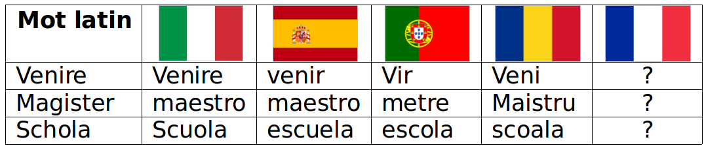
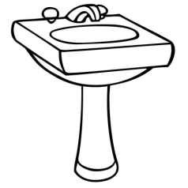

Le latin est une langue ancienne, qui n’est plus parlée mais est encore traduite.    
Elle a donné naissance à beaucoup de langues européennes : le français, l’italien, l’espagnol, le portugais et le roumain.    

<b>Petit test:</b>   
{width="70%"}

C'est une langue morte mais tu la parles tous les jours !    

<b>Exemple:</b>    

|  |  |  |  |
|------------------|-----------------|-----------------|-----------------|
| A _ _ _ _ _ _ _  | L _ _ _ _ _     | A _ _ _ _ _     | P _ _ _ _ _     |

